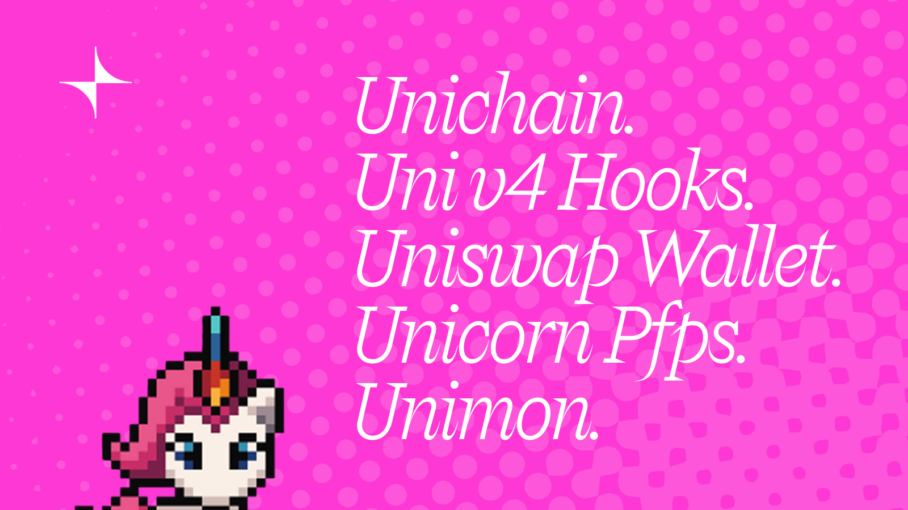

# 🦄 Unimon - The First Game in a V4 Hook!

This is a foundry repository containing the hook & auxillary contracts needed to launch Unimon, a novel game baked into a Uniswap V4 Hook. We utilize OpenZeppelin's BaseHooks & implement our own custom logic where needed.

## 🔑 Key Contracts

- `UnimonEnergy.sol` - An illiquid ERC20 Token (UMN) acquired through a v4 LP position, needed to play the game.
- `UnimonHook.sol` - An blended ERC721 & Hook contract, designed to mint ERC721 upon swaps.
- `UnimonBattles.sol` - The core battle logic for "Phase 3: The War".
- `UnimonUserRegistry.sol` - Username list for tracking in the game

## 🚗 Getting Started

1. Run `npm i`.
2. Copy `.env.example` as `.env`.
3. Run `forge install foundry-rs/forge-std`

## 🤝 Helpful Repo Commands

- `forge test` run Foundry tests
- `forge build` compile Foundry contracts
- `npm run deploy:<hook || energy || registry || battles>`

## Deployed Contracts

- [UnimonEnergy](https://uniscan.xyz/address/0x7edc481366a345d7f9fcecb207408b5f2887ff99)
- [UnimonHook](https://uniscan.xyz/address/0x7f7d7e4a9d4da8997730997983c5ca64846868c0)
- [UnimonBattles](https://uniscan.xyz/address/0xebc5e87691a335747c9a516cd31abe6fbe584866)

## Battle Management

#### Battle Initialization

MAKE SURE TIMING IS SET UP RIGHT (START TIME AND CYCLE TIME) 0. Give any operational addresses the ability to fulfill randomness.

1. Call `setGameManager` on UMN contract with Battles contract (done in script)
2. Call `killUnhatched` for all IDs in circulation (batches of 1000, up to 5003)
3. Toggle `toggleBattles(true)` to enable battles.
4. Update & Swap out GhostGraph & contract(s) in API.

#### Battle Management

In the grace period...

1. Run `resolveAnyIncompleteBattles` over a range of encounters to select winners (batches of 1000).
2. Run `updateStatusesForNextCycle` over a range of all Unimon (batches of 1000, up to 5003).
3. Mark `completedCycle` to mark them all as true.

## 📝 Important Notes

- Make sure Energy is a GameManager & The Hook has the configured energy contract!
