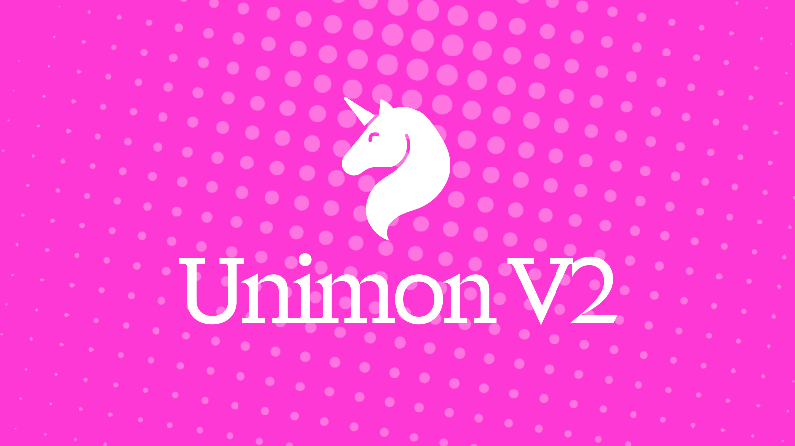

# 🦄 Unimon - NFT Collection Game with Evolution & Equipment!

This is a foundry repository containing the v2 contracts for Unimon, a complete NFT collection game featuring evolution mechanics, equipment systems, and item management. Built as a standalone game using OpenZeppelin standards.

## 🔑 Key Contracts (V2)

- `UnimonV2.sol` - Main ERC721 NFT contract with evolution mechanics and customizable stats
- `UnimonMinter.sol` - ETH-based minting system with item distribution and prize functionality
- `UnimonItems.sol` - ERC1155 contract managing energy, gacha keys, and mint coupons
- `UnimonEquipment.sol` - Equipment system allowing items to modify Unimon stats
- `UnimonGacha.sol` - Gacha system for obtaining rare items and equipment

## 🎮 Game Features

- **Evolution System**: Evolve your Unimon using energy tokens for random stat bonuses
- **Equipment System**: Equip items to modify attack/defense stats with percentage bonuses
- **Item Management**: Collect energy, gacha keys, and mint coupons as ERC1155 tokens
- **Customization**: Set custom names for your Unimon (up to 24 characters)
- **Minting**: Direct ETH minting with automatic item distribution
- **Prize System**: Built-in prize claiming functionality for community rewards

## 🚗 Getting Started

1. Run `npm i`.
2. Copy `.env.example` as `.env`.
3. Run `forge install foundry-rs/forge-std`

## 🤝 Helpful Repo Commands

- `forge test` - Run Foundry tests
- `forge build` - Compile Foundry contracts
- `npm run deploy:v2` - Deploy v2 contracts

## 🎯 Contract Interactions

### Minting Unimon

- **Regular Mint**: Call `mint(amount)` on UnimonMinter with ETH (0.0000111 ETH per NFT)
- **Coupon Mint**: Call `mintWithCoupons(amount)` for 50% discount using mint coupons
- **Item Distribution**: Each mint gives 4 energy + 1 gacha key automatically

### Evolution System

- **Evolve**: Call `evolve(tokenId, energyAmount)` on UnimonV2 (1-10 energy)
- **Stats**: Random bonuses based on energy amount, higher energy = higher potential
- **One-time**: Each Unimon can only evolve once

### Equipment System

- **Equip**: Call `equipItem(tokenId, itemId)` on UnimonEquipment
- **Unequip**: Call `unequipItem(tokenId)` to remove equipment
- **Bonuses**: Items provide flat attack/defense modifiers + percentage bonuses

### Gacha System

- **Request**: Call `requestGacha(amount)` on UnimonGacha to spend gacha keys
- **Claim**: Call `claimItems(requestIds)` after randomness is provided
- **Rewards**: Random items based on weighted probabilities with supply limits
- **Backup Items**: Guaranteed fallback items when rare items are sold out

### Items Management

- **Energy (ID: 0)**: Used for evolution, obtained from minting/gacha
- **Gacha Keys (ID: 1)**: Used for gacha pulls, obtained from minting
- **Mint Coupons (ID: 2)**: 50% mint discount, obtained from v1 airdrop/gacha

## 🔄 V1 to V2 Migration

Unimon has evolved from a Uniswap V4 Hook-based game to a standalone NFT collection game:

- **V1 (Hook Era)**: Game played through Uniswap swaps, energy from LP positions
- **V2 (Collection Era)**: Traditional NFT minting, evolution, and equipment systems
- **Migration Benefits**: V1 users receive airdropped gacha keys and mint coupons
- **Airdrop**: One-time `v1Airdrop()` function distributes items to qualifying addresses

## 📝 Important Notes

- V2 contracts are completely standalone - no hook dependencies
- All items are ERC1155 tokens for gas efficiency
- Equipment modifies stats temporarily while equipped
- Evolution bonuses are permanent and random
- Max supply: 10,000 Unimon NFTs
- Custom names supported (1-24 characters)
